# Modular NLP/NLI Analysis Package

## Diagram 1: Document Processor
### Segmentation & Classification

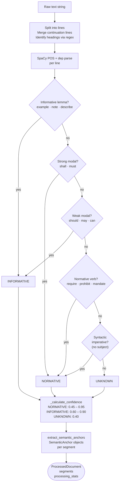

## Diagram 2a: Term Extraction Methods

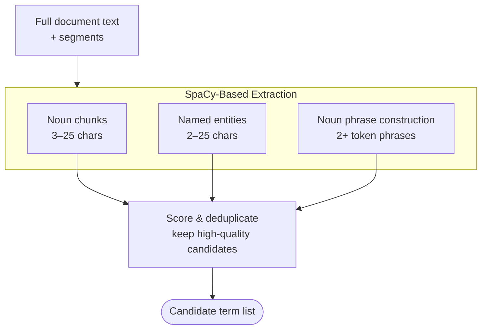
## Diagram 2b: Term Classification

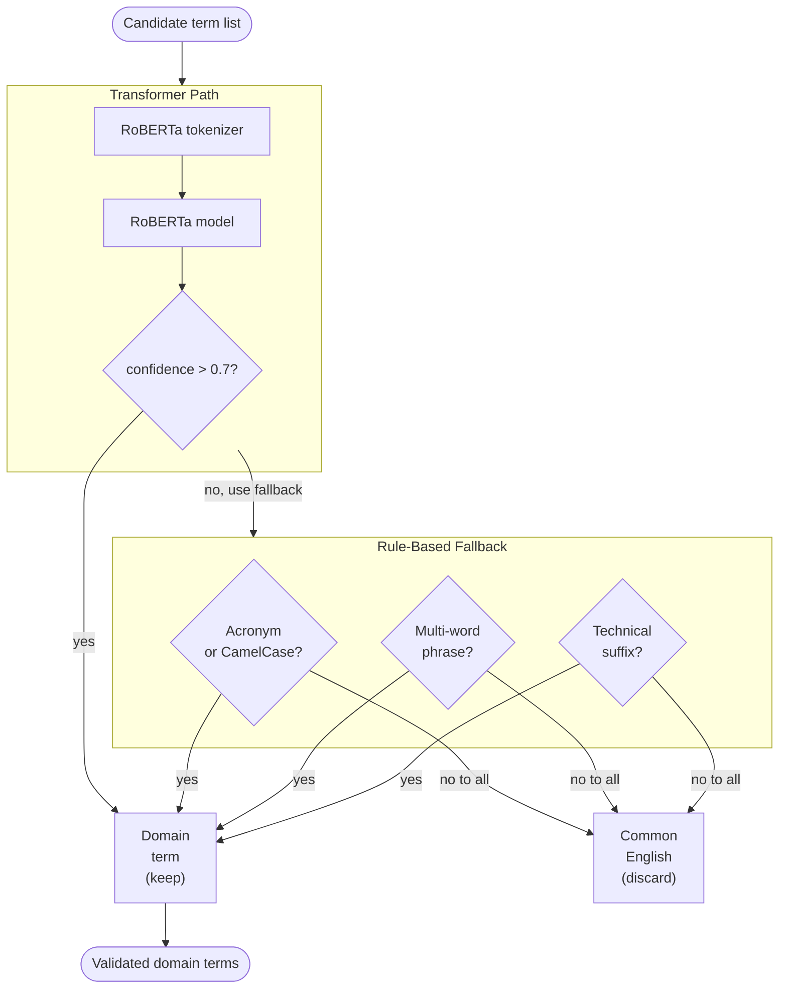
## Diagram 2c: Definition Detection

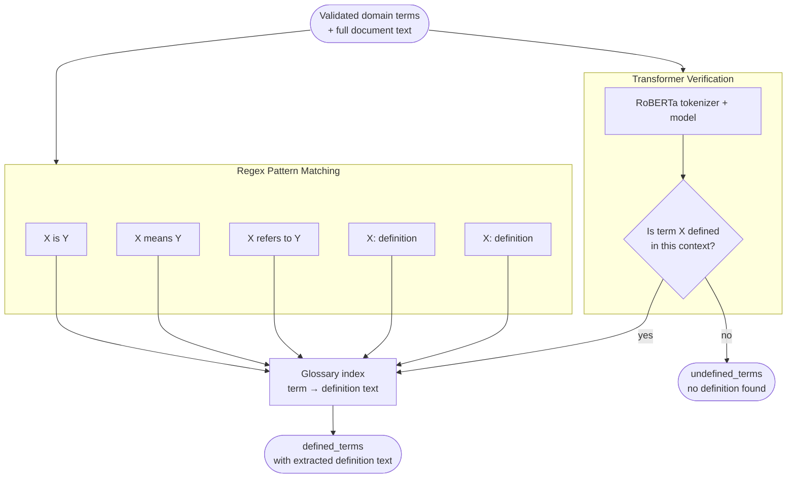
## Diagram 2d: Semantic Clustering

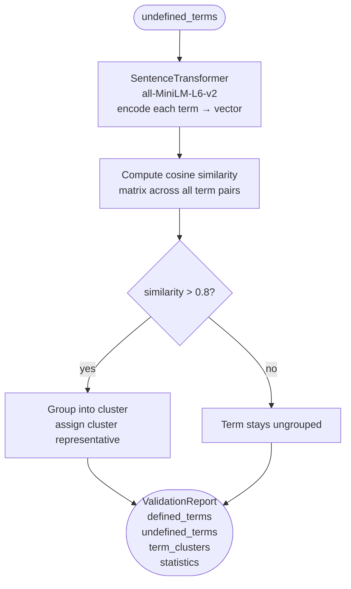
## Diagram 3a: Candidate Pair Generation

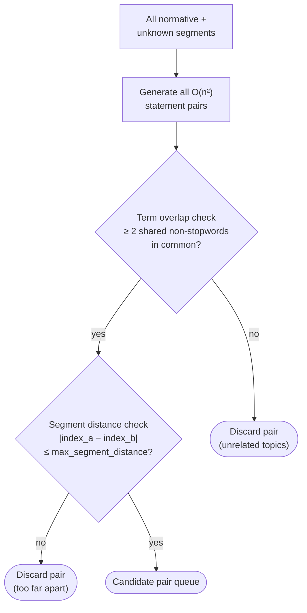
## Diagram 3b: Stage 1: Rule-Based Contradiction Detection

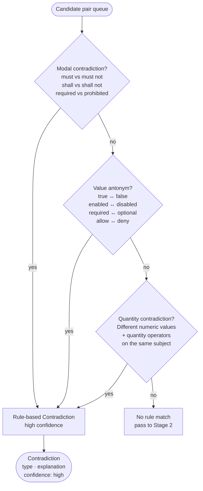
## Diagram 3c: Stage 2: ML-Based Contradiction Detection (NLI)

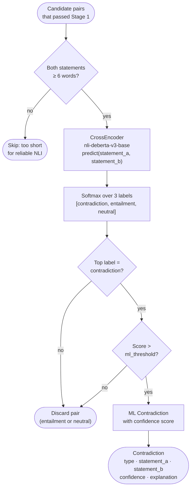
## Diagram 4a: S2 Taxonomy: Routing Overview

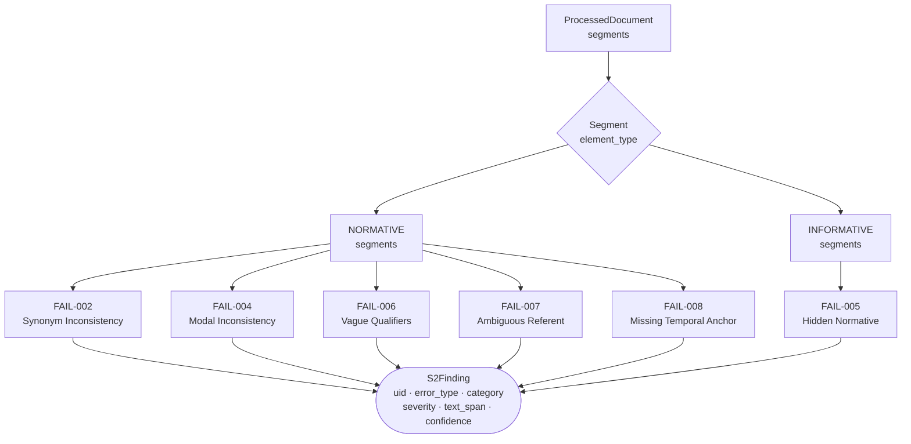
## Diagram 4b: FAIL-002 and FAIL-004

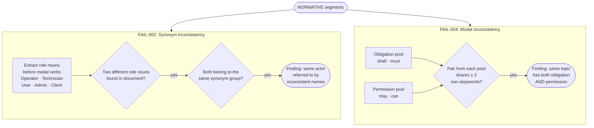

## Diagram 4c: FAIL-005 and FAIL-006

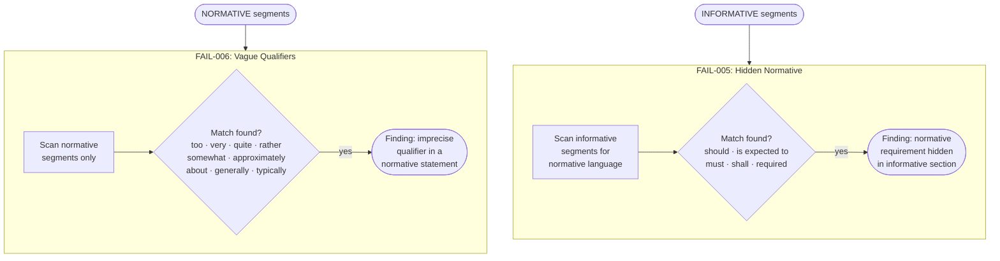

## Diagram 4d: FAIL-007 and FAIL-008

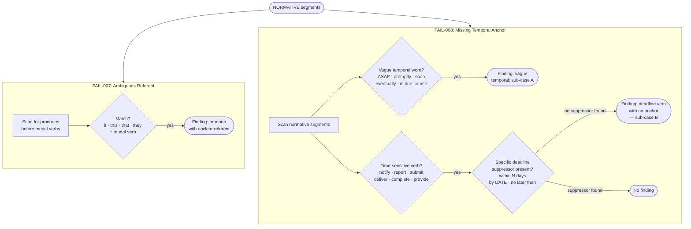