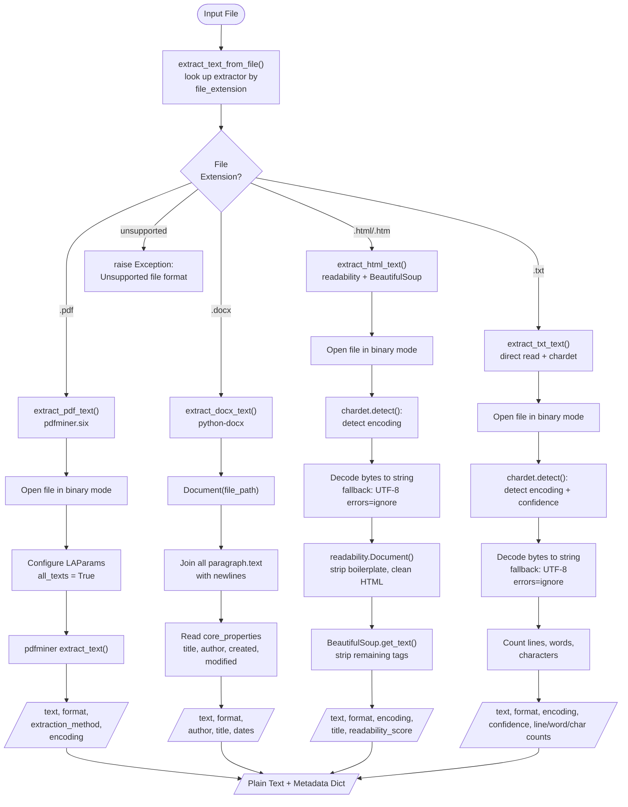

## Clarus Tool Preprocessing Pipeline

```mermaid
flowchart TD
    A([Input File]) --> B["extract_text_from_file()\nlook up extractor by <br/>file_extension"]

    B --> C{File\nExtension?}

    C -- .pdf --> D["extract_pdf_text()\npdfminer.six"]
    D --> D1["Open file in binary mode"]
    D1 --> D2["Configure LAParams\nall_texts = True"]
    D2 --> D3["pdfminer extract_text()"]
    D3 --> D4[/"text, format, <br/>extraction_method,<br/> encoding"/]

    C -- .docx --> E["extract_docx_text()\npython-docx"]
    E --> E1["Document(file_path)"]
    E1 --> E2["Join all paragraph.text\nwith newlines"]
    E2 --> E3["Read core_properties\ntitle, author, created, <br/>modified"]
    E3 --> E4[/"text, format, <br/>author, title, dates"/]

    C -- .html/.htm --> F["extract_html_text()\nreadability + BeautifulSoup"]
    F --> F1["Open file in binary mode"]
    F1 --> F2["chardet.detect(): <br/>detect encoding"]
    F2 --> F3["Decode bytes to string\nfallback: UTF-8 errors=ignore"]
    F3 --> F4["readability.Document()\nstrip boilerplate, clean HTML"]
    F4 --> F5["BeautifulSoup.get_text()\nstrip remaining tags"]
    F5 --> F6[/"text, format, encoding,<br/> title, readability_score"/]

    C -- .txt --> G["extract_txt_text()\ndirect read + chardet"]
    G --> G1["Open file in binary mode"]
    G1 --> G2["chardet.detect(): <br/>detect encoding + confidence"]
    G2 --> G3["Decode bytes to string\nfallback: UTF-8 <br/>errors=ignore"]
    G3 --> G4["Count lines, words,<br/> characters"]
    G4 --> G5[/"text, format, encoding, <br/>confidence, line/word/char counts"/]

    C -- unsupported --> ERR[raise Exception: <br/>Unsupported file format]

    D4 & E4 & F6 & G5 --> OUT[/"Plain Text + Metadata Dict"/]
```